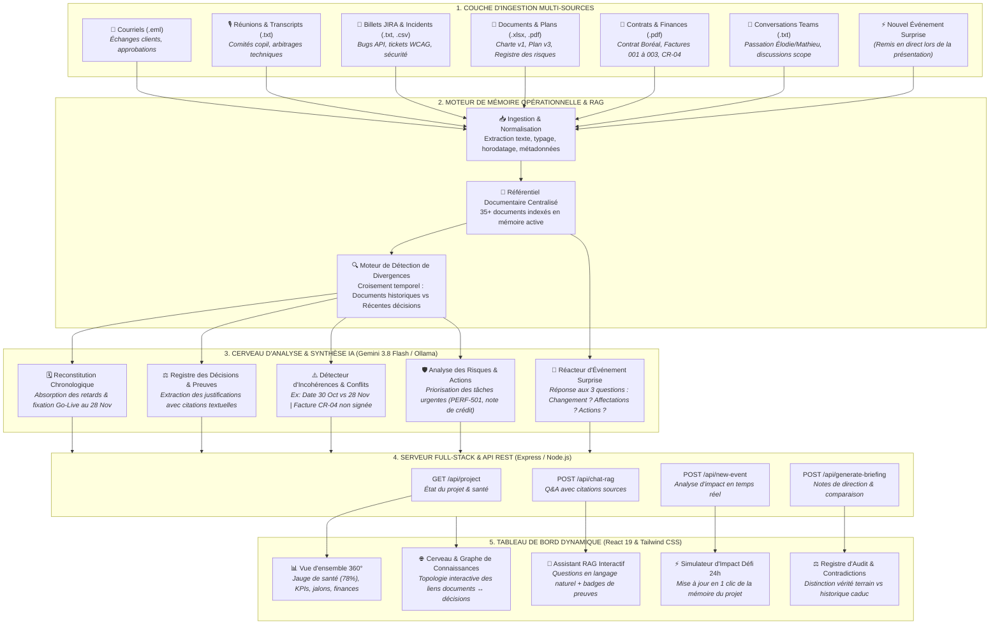
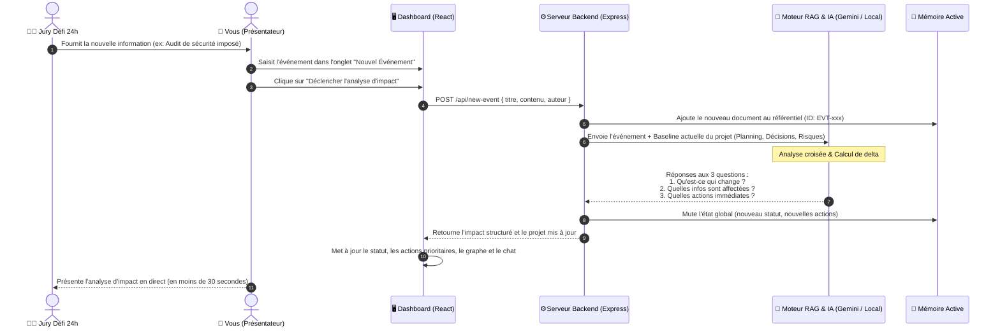

# Architecture & Flux de Fonctionnement du Système — Projet 360

Ce document décrit en détail l'architecture technique, le pipeline RAG et le flux de traitement des données du système **Projet 360**.

---

## 📊 Diagramme Mermaid.js Global du Système

Vous pouvez copier ce bloc Mermaid directement dans [Mermaid Live Editor](https://mermaid.live), GitHub, Notion ou tout visualiseur Markdown :

---

## 🔁 Diagramme de Séquence : Traitement de l'Événement Imprévu

Ce diagramme illustre le flux exact qui s'exécute lorsque vous recevez la nouvelle information surprise lors de la présentation finale :

---

## 🛠️ Explication des 5 Étapes du Processus

### 1. Ingestion Multi-Sources
Le système n'est pas limité à un seul format de fichier. Il accepte et normalise :
* Les **courriels bruts (.eml)** avec extraction des expéditeurs et dates.
* Les **procès-verbaux et transcriptions audio (.txt)** pour capter les arbitrages verbaux.
* Les **billets Jira (.txt, .csv)** pour le suivi technique et les anomalies.
* Les **documents formels (.pdf, .xlsx, .md)** pour la charte, les plans de projet et les contrats.

### 2. Moteur de Détection des Conflits
Au lieu de simplement indexer des mots-clés comme un moteur de recherche classique, le système analyse la **validité temporelle** des informations :
* Il repère qu'une information dans un document initial (ex: la date du 30 octobre dans la Charte v1) a été **remplacée et invalidée** par une décision officielle postérieure (ex: la date du 28 novembre dans le comité du 10 septembre).
* Il détecte les **contradictions financières** (ex: la facture INV-003 réclame 14 500 $ pour un avenant mobile CR-04 qui n'a jamais été approuvé).

### 3. Justification par Citations Sourcées (Anti-Hallucination)
Toute réponse fournie par l'Assistant RAG s'accompagne d'une **preuve documentaire vérifiable** :
* Nom exact du fichier source.
* Citation textuelle entre guillemets.
* Niveau de validité opérationnelle (Valide, Obsolète ou En attente).

### 4. Réacteur d'Événement en Direct
Conçu spécialement pour la règle clé du Défi 24h :
* Le système ne nécessite pas de recompiler ou de redémarrer le serveur.
* L'événement est absorbé en temps réel en mémoire active.
* Les 3 réponses attendues par les juges sont générées avec précision.

### 5. Interface Décisionnelle
La barre latérale épurée donne un accès immédiat aux différentes vues :
* **Vue d'ensemble :** Pilotage exécutif et métriques clés.
* **Cerveau & Graphe :** Compréhension visuelle des dépendances documentaires.
* **Assistant RAG :** Dialogue naturel pour interroger le projet.
* **Registre des Décisions :** Traçabilité et conformité d'audit.
